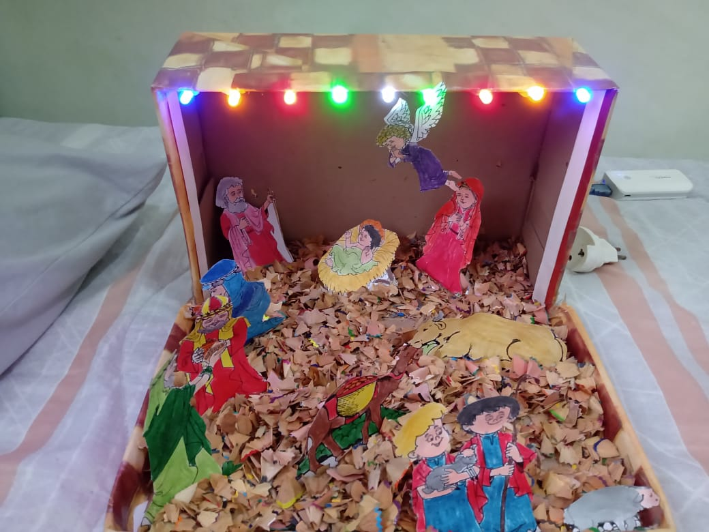
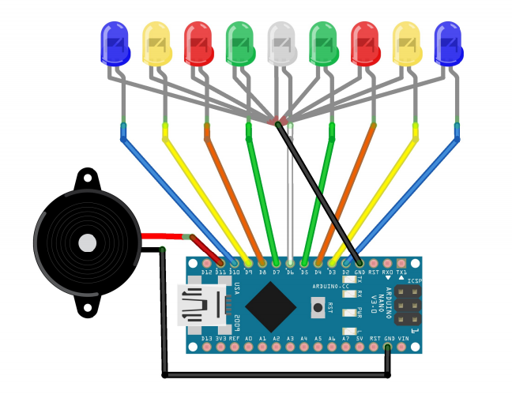

# Christmas Lights

## Required Materials:

* **1 small nativity scene**;  
* **1 Arduino Nano**;
* **9 Leds 5mm**, in the colors of your choice;
* **1 Passive Buzzer 5V**.

You can make your own nativity scene, using a shoe box, residue of sharpened pencil and your creativy;

## Arduino Circuit:

## Video

